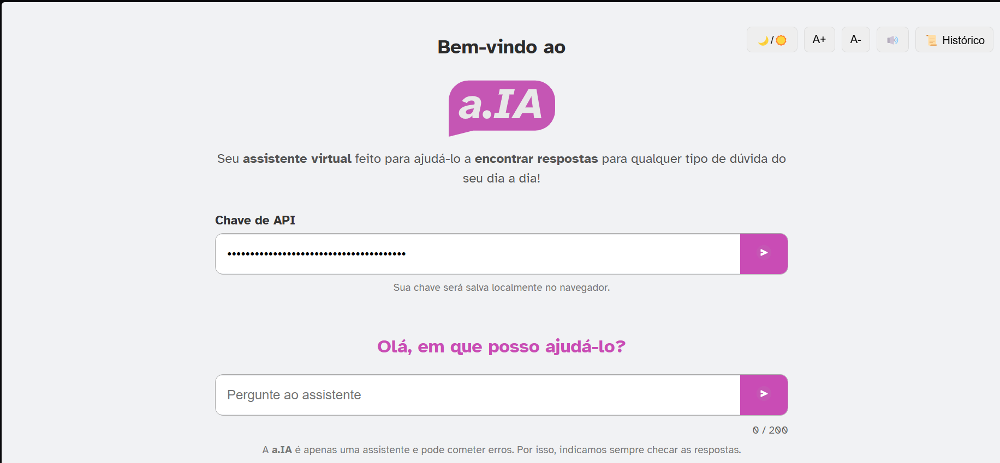

# a.IA - Assistente Virtual

## Visão Geral
**a.IA** é um assistente virtual desenvolvido para fornecer respostas rápidas e úteis para dúvidas do dia a dia. Ele integra APIs de geração de conteúdo (OpenAI e Gemini), permitindo consultas inteligentes com histórico, leitura de respostas, ajuste de fonte e suporte a modo claro/escuro.

O projeto foi desenvolvido com foco em **acessibilidade**, oferecendo recursos que permitem fácil interação para todos os tipos de usuários.

---

## Funcionalidades Principais

- **Envio de perguntas** via API (OpenAI ou Gemini)  
- **Histórico de perguntas** em dropdown para melhor organização  
- **Ajuste de fonte**: aumente ou diminua o tamanho do texto  
- **Modo claro/escuro** para conforto visual  
- **Exportação de conversas em PDF** com logo e cores magenta destacadas  
- **Copiar respostas** para a área de transferência  
- **Limpar campos** de pergunta e resposta  
- **Leitura de respostas** com botão de iniciar/parar  
- **Contador de caracteres** para perguntas  
- **Responsivo** para diferentes dispositivos  

---

## Tecnologias Utilizadas

- **HTML5 / CSS3 / JavaScript (Vanilla)**
- [jsPDF](https://github.com/parallax/jsPDF) para exportação de PDF
- APIs de geração de conteúdo:
  - OpenAI GPT-3.5
  - Gemini (Google)
- Fontes acessíveis: **Atkinson Hyperlegible**, **Sora**
- Cores do projeto: magenta #c94cb5, tons neutros e dark mode cinza escuro

---

## Instalação

1. Clone o repositório:

git clone https://github.com/DanielleJeanine/a.IA.git

2. Abra o projeto em seu navegador:

Abrir index.html diretamente, ou

Configurar um servidor local (recomendado para fetch API)

---

## Uso

1. **Inserir chave de API**: Digite sua chave (OpenAI ou Gemini) na interface.
2. **Inserir pergunta**: Digite no campo de texto.
3. **Enviar**: Clique no botão enviar ou pressione Enter.
4. **Visualizar resposta**: A resposta aparece na área de resposta, com Markdown renderizado.
5. **Copiar texto**: Clique no botão 📋 para copiar a resposta.
6. **Limpar texto**: Clique no botão 🗑️ para limpar pergunta e resposta.
7. **Exportar PDF**: Clique no botão 📄 para salvar a conversa em PDF formatado.
8. **Histórico**: Clique no botão "Histórico" para visualizar perguntas anteriores.
9. **Acessibilidade**: Ajuste a fonte e alterne entre modo claro e escuro.
10. **Leitura de texto**: Selecione texto na resposta e clique no botão 🔊 para ler, ou ⏹️ para parar.

---

## Estrutura do projeto

a.IA/
├─ index.html          # Página principal
├─ style.css           # Estilos CSS
├─ script.js           # Lógica JavaScript
├─ assets/             # Imagens, logos e ícones
│   ├─ logo.svg
│   ├─ botao.svg
│   └─ demo-banner.png
└─ README.md           # Documentação do projeto

---

## Equipe de Desenvolvimento

- **[Carla Matos](https://github.com/carlapw)** – Estrutura HTML
- **[Danielle Jeanine](https://github.com/DanielleJeanine)** – Script de Acessibilidade
- **[Ítalo Feitosa](https://github.com/Itajen)** – Integração de APIs
- **[Thiago dos Reis](https://github.com/tchaaago)** – UI/UX e design responsivo

---

## Sugestões de Futuras Melhorias

- Suporte a múltiplos idiomas
- Exportação de PDF do histórico
- Sistema de login para múltiplos usuários com histórico separado